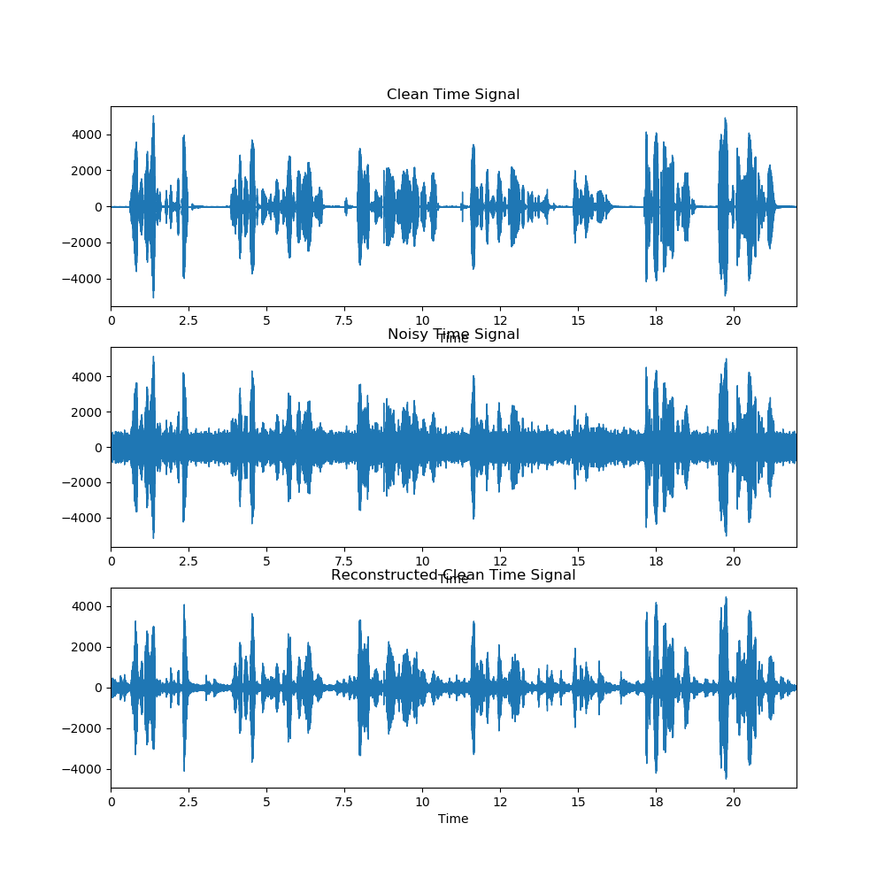
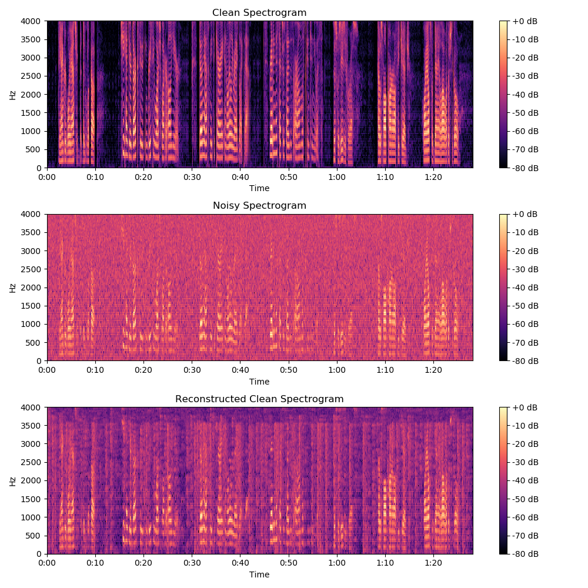

# Speech Enhancement Using MMSE-STSA

It's a minimum mean-squre error short-time spectral amplitude (MMSE-STSA) estimator which is the most poplular statistical model-based technique for speech enhancement.

## Results
### Time domain

### Frequency domain

## References
* [1] [Y. Ephraim and D. Malah, "Speech enhancement using a minimum-mean square error short-time spectral amplitude estimator," IEEE Trans Acoustics Speech and Signal Processing, VOL. 32(6):1109-1121, Dec 1984.](https://ieeexplore.ieee.org/stamp/stamp.jsp?arnumber=1164453)

